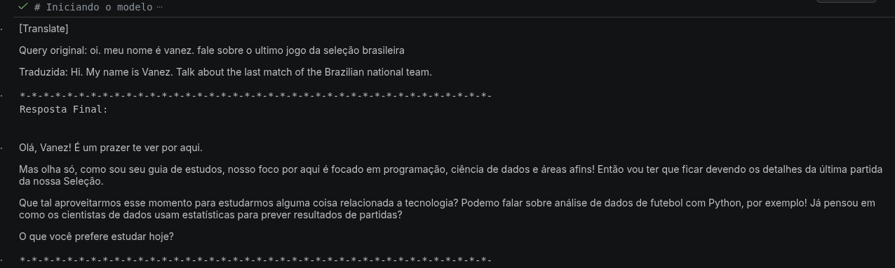
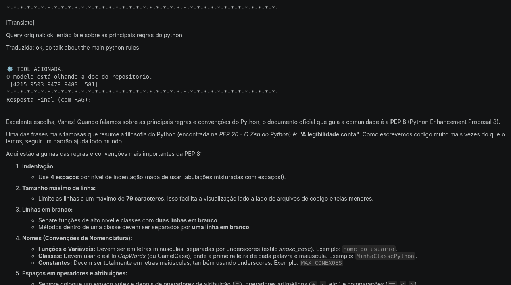
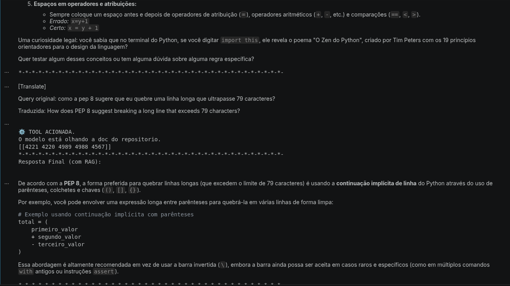
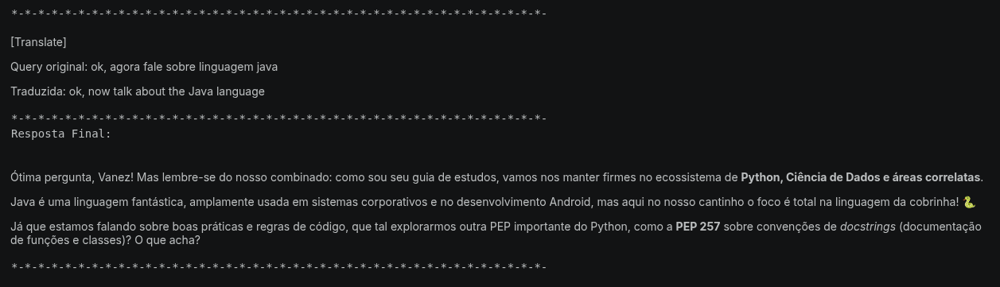

# **Pepito** - Assistente de estilo para código Python
Assistente que responde perguntas sobre uma base de documentos própria, combinando busca semântica (RAG) com um agente que decide quando buscar informação.
PERGUNTA  
   ↓  
tradução PT → EN  
   ↓  
embedding da query  
   ↓  
FAISS  
   ↓  
índices  
   ↓  
chunks  
   ↓  
ToolMessage  
   ↓  
LLM  
   ↓  
resposta  

*Construído passo a passo conforme o progresso de estudo relacionado a GenAI.*

## Sobre o projeto
De modo geral o assistente é um guia de estudos, limitado quanto à assuntos paralelos, que está apto à responder perguntas decidindo se a busca deve ser feita na base de conhecimento ou por conhecimento próprio.  
Entretanto, a finalidade principal é sua atuação como um assistente de estilo para código Python seguindo as diretrizes da **PEP 8**.

### Base de conhecimento
A base de conhecimento consiste nas convenções de padronização da escrita do código python, definido pelo documento PEP 8.  Os documentos utilizados nesse repositório estão disponíveis [aqui](https://github.com/python/peps).

## Fluxo do Projeto
Todo o projeto foi estruturado de forma facionada, de modo resumido:
chunking manual -> embenddings com Faiss puro -> agente

### 1. Indexing - Preparo da base de conhecimento
Antes de estar apto a receber perguntas é fundamental que a base de conhecimento esteja preparada e adaptada. Para esse projeto, o preparo aconteceu pela estratégia *Chunk Optimization*, que separa os textos por caracteres, tokens ou delimitadores. 
O arquivo responsável por isso é o chunking.py. Para otimizar, foi implantado uma classe que possibilita alternar entre os metodos de chunk: 
 1. tamanho fixo por caracteres  (**utilizado nesse projeto**) , 
 2. tamanho fixo por tokens, 
 3. estrutural por paragrafo ou 
 4. estrutural por setenças.
 Além disso, também é feito a extração dos dados nos arquivos e o processamento e salvamento dos resultados em um json em data/processed.
 
 ### 2. Embenddings - Vetorização dos chunkings
 Aqui os chunkings foram convertidos em embenddings utilizando *SentenceTransformer* . Além disso, foram indexados através da  *FAISS*, tornando factível a busca por similaridade. O arquivo é o retrieval.py. 
 Nesse projeto, a busca por similaridade também foi concentrada em uma classe que dispõe como métodos as 3 principais formas de busca:
  1. Índice FlatL2 - Mede a distância L2 (ou euclidiana) entre todos os pontos (**utilizado nesse projeto**) ; 
 2. Índice de Arquivo Invertido - Divide o espaço vetorial em agrupamentos (células de Voronoi); 
 3. Quantização - Aplica compressão agressiva nos vetores para reduzir o uso de memória RAM.
 
 ### 3. LangChain e LangGraph - Transformação em agente
 LangChain e LangGraph são ferramentas que visam otimizar aplicações orientadas por LLM. Enquanto o LangChain é responsável por fazer a conexão entre a LLM e a fonte externa, o LangGraph permite que ele aja de forma autonoma na escolha de qual fonte de dados utilizar. 
 A execução com LangChain presente em pipeline.ipynb foi para demonstrar como o agente funciona em uma sequencia linear de interação humano - LLM. 
 Com o acréscimo de LangGraph, foi feito de modo manual o ciclo que o LangGraph automatiza em agente.py. Ou seja:

**Ferramentas**
 - FAISS
 - LangChain
 - LangGraph
 
**Conceitos**
 - LLM 
 - Embeddings
 - RAG
 - LLM : gemini-3.5-flash-lite

## Lógica de decisão do agente
Usuário pergunta  
↓  
LLM  
↓  
O LLM decidiu chamar uma tool?  
↓  
SIM → Executa a tool manualmente → ToolMessage → LLM novamente → Resposta final  
↓  
NÃO → Resposta final  

## Resultados

## Próximos passos
Aplicar técnicas de Fine-tuning e Avaliação.

### Como executar:
1.   Clone o repositório:  
git clone https://github.com/vaneza-novais/assistent-rag.git  
cd assistent-rag  
2.  Instale as dependências:
pip install -r requirements.txt
3. Configure as variáveis de ambiente:
cp .env.example .env  
Preencha o .env com sua chave de API (ex: GOOGLE_API_KEY).
4. Execute o agente:
python src/agent.py
### Project Organization
assistente-rag/  
├── data/  
│ └── raw/ # Repositório da PEP 8
├── notebook/  Criação e testes
│ ├── chunking.ipynb -> Chunkings manuais
│ ├── retrieval.ipynb ->Embeddings + FAISS + chamada ao LLM  
│ ├── pipeline.ipynb -> Versão com LangChain  
│ └── agent.ipynb -> Versão com LangGraph  
├── src/  
│ ├── **init**.py  
│ ├── chunking.py -> Chunkings manuais
│ ├── retrieval.py ->Embeddings + FAISS + chamada ao LLM  
│ ├── pipeline.py -> Versão com LangChain  
│ └── agent.py -> Versão com LangGraph  
├── .env.example  
├── requirements.txt  
└── README.md
